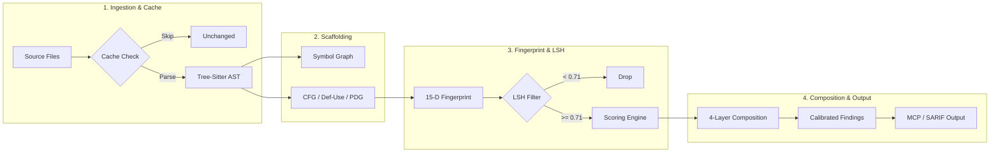
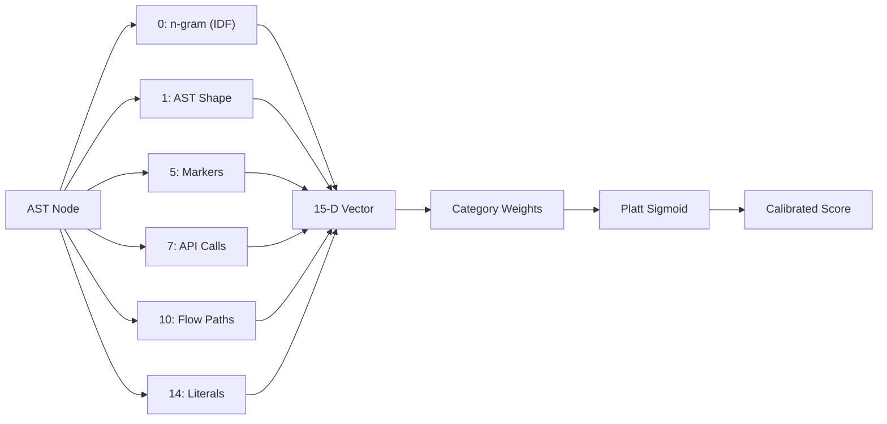
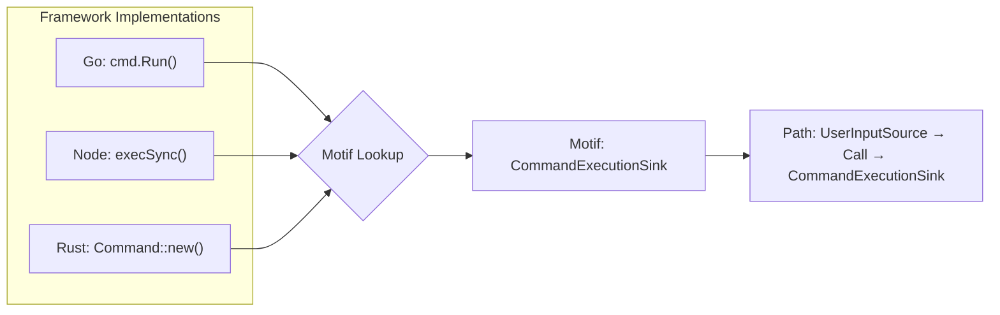
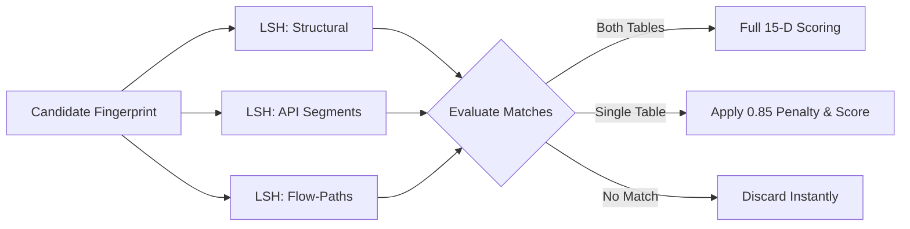
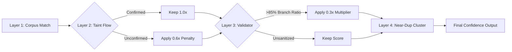
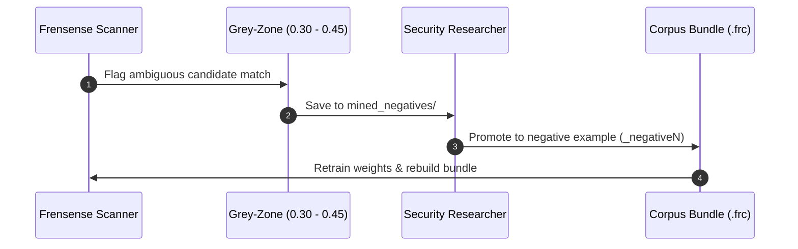

---

title: "How Frensense Built Its Engine: A Fingerprint-Based Approach"

date: 2026-09-17

excerpt: "Every traditional SAST tool operates on rules. Frensense made a different bet: the core primitive is a function fingerprint, not a rule."

---


# How Frensense Built Its Engine: A Fingerprint-Based Approach to Static Analysis

Every traditional SAST tool operates on rules. A rule says: *"find a call to `exec()` where the first argument contains a variable that came from `req.query`."* Rules are hand-written, language-specific, and brittle. 

Frensense made a different bet: **the core primitive is a function fingerprint, not a rule.**

Instead of asking *"does this code match a pattern?"*, the engine asks *"does this function resemble a class of previously-seen vulnerable functions?"* The matching unit is a pair of fingerprints — one from a known-vulnerable function, one from its fixed counterpart — and the engine scores every candidate function against that pair to decide whether it looks more like the vulnerable version or the safe one.

This changes everything downstream. Patterns can be created by showing the engine two files: a buggy version and a fixed version. The engine generalizes across minor refactorings, variable renames, and even framework changes without needing new rules. Most importantly, detection quality improves as the corpus of known vulnerability pairs grows, without anyone writing new rules.

Below is the visual overview of how code moves through this entire pipeline, from raw source files to calibrated advisories.



---

## The LanguageSpec Trait: Language Knowledge in One Place

Before analyzing logic or data flows, the engine must understand language syntax. Every engine subsystem that previously contained hardcoded `match kind { "call_expression" | … }` arms calls a single trait method instead. Before this abstraction was built, nine separate sites in the codebase pattern-matched raw tree-sitter kind strings. Adding a new language required updating nine places — and forgetting any one of them produced a silent empty result, not a compiler error.

The `LanguageSpec` trait collects all language-specific knowledge in one contract:

```rust
fn classify(&self, kind: &str) -> NodeRole;
fn extract_imports(&self, root: Node, source: &str) -> Vec<Import>;
fn classify_param_taint(&self, name: Option<&str>, type_annotation: Option<&str>) -> Option<TaintOrigin>;
fn classify_sanitizer(&self, call_name: &str) -> Option<SanitizerKind>;
fn propagator_rules(&self) -> &'static [PropagatorRule];
fn package_category(&self, package: &str) -> Option<PackageCategory>;
```

The `NodeRole` enum carries the field names for the classified node so callers never need a second lookup:

```rust
NodeRole::Call { callee_field, args_field } => {
    let callee = node.child_by_field_name(callee_field);
    let args   = node.child_by_field_name(args_field);
}
```

Special structural patterns that only exist in one language are modeled as optional methods with default no-op implementations: `is_error_guard` (Go `if err != nil`), `context_manager_call` (Python `with … as`), `ErrorPropagation` (Rust `?`), and `Await` (JS/TS/Python). Providers exist today for JavaScript/TypeScript, Python, Go, Rust, and C. Adding a new language requires just one file implementing the trait.

---

## The Function Fingerprint: 15 Dimensions

A `FunctionFingerprint` is a struct of hash vectors, each representing a different semantic facet of a function. The 15 scoring dimensions used in both matching and learning are:

| # | Dimension | What It Captures |
|---|-----------|------------------|
| 0 | **n-gram similarity** | Token-level code structure, IDF-weighted |
| 1 | **AST skeleton similarity** | Structural shape; normalized for/while/if equivalences |
| 2 | **signature n-grams** | Parameter names and types in the function signature |
| 3 | **param type n-grams** | Type annotations on parameters specifically |
| 4 | **type usage overlap** | Framework types (`Request`, `Context`, `Json`) used in the body |
| 5 | **semantic markers** | Hardcoded and learned category tags (`SqlSink`, `UserInput`, etc.) |
| 6 | **control-flow similarity** | Which control structures appear |
| 7 | **API call similarity** | What functions are called |
| 8 | **tainted API call similarity** | API calls where parameters are arguments |
| 9 | **motif containment** | Abstract semantic equivalents of API calls |
| 10 | **flow-path containment** | Abstract source→sink paths through the function |
| 11 | **config literal similarity** | Configuration patterns in string literals |
| 12 | **control-flow order similarity** | The *sequence* of control flow events |
| 13 | **argument call type similarity** | What AST kinds appear in call positions |
| 14 | **literal pattern similarity** | Content patterns inside string/template arguments |

Each dimension is computed as a Jaccard or containment similarity between the candidate's vector and the corpus target's vector. 



Why 15 dimensions rather than one? Because each captures a different failure mode. N-gram similarity misses refactored code; AST skeleton similarity catches structural shape changes; motif similarity catches API-name changes. By combining them, the scorer degrades gracefully when some dimensions are uninformative.

---

## IDF Weighting: Making Common Patterns Count Less

Not all code tokens are equally meaningful. An `if` statement or a `return` expression appears in almost every function; a call to `sqlx::query!` appears in a narrow class of functions. The engine computes **Inverse Document Frequency (IDF)** weights across all positive corpus fingerprints at bundle-build time.

The IDF weight for a hash $h$ is:

$$\text{IDF}(h) = \ln\left(\frac{\text{total\_patterns}}{\text{doc\_freq}(h)}\right)$$

Common hashes get weights near zero; rare hashes get high weights. These weights are applied to the `weighted_ngram_hashes` field of every fingerprint in the corpus and on every candidate at scan time, before scoring begins. 

Borrowing directly from information retrieval, structural patterns shared by all functions (loops, conditionals, returns) contribute little to similarity, while rare patterns specific to a vulnerability class (a particular sink call, a specific chained access pattern) dominate the score.

---

## Motifs: Cross-Framework Generalization Without More Corpus

The most structurally novel component is the motif system. A **motif** is a named group of semantically equivalent API calls:

```
CommandExecutionSink:
  exec, execSync, spawn, spawnSync, Command::new,
  ProcessBuilder, Runtime.exec, os.system, subprocess.run, ...

UserInputSource:
  req.body, req.query, req.params, c.Param, r.FormValue,
  Query, Path, Form, Json, @RequestParam, [FromBody], ...
```

At fingerprint time, every API call is checked against the motif lookup table. If it matches, it is hashed under the *motif name* (`CommandExecutionSink`) rather than its literal string (`exec`). This motif hash is stored in `motif_hashes`.



A corpus pattern trained on Express/TypeScript with `exec()` matches a Go handler using `cmd.Run()` or a Rust function using `Command::new()` — because all three produce the same `CommandExecutionSink` motif hash. The engine achieves cross-framework and partial cross-language matching without needing separate corpus entries per framework.

The same mechanism powers the flow-path system. Abstract source→sink paths are recorded as sequences of motif names:

```json
["UserInputSource", "assignment", "call", "CommandExecutionSink"]
```

These paths are hashed and stored in `data_flow_path_hashes`. The path hash is invariant to variable names, helper extraction, and framework identity — it encodes only what kind of data flowed to what kind of sink. This dimension (flow-path containment, index 10) ends up as the highest-weighted dimension in the default weight vector because it generalizes better than any other.

---

## CFG, Def-Use, and PDG: The Analysis Foundation

The engine builds three layers of analysis infrastructure per function:

1. **Control Flow Graph (CFG):** Walks the AST and groups statements into `BasicBlock`s. Each block gets a `kind` label (`"if_branch"`, `"loop_body"`, `"try_block"`) and explicit `successors`/`predecessors` with labeled edge kinds (`Unconditional`, `Branch`, `Merge`, `BackEdge`, `Exception`). Back edges are detected during construction, and dominator sets are pre-computed using the standard iterative dataflow algorithm.
2. **Def-Use Chain:** Walks the CFG and records def sites and use sites for each variable at the statement level. Supports forward queries (`uses_of(var)`) and backward queries (`defs_reaching(var, use_site)`), used by the taint propagator to track data flow through assignments.
3. **Program Dependence Graph (PDG):** Computed from the CFG and def-use chain. Records two edge types:
   - `DataDependence { var_name }`: A use of `var_name` at node B is reachable from a definition at node A.
   - `ControlDependence`: Node B executes if and only if node A's branch is taken.

Post-dominator sets are computed via the reverse CFG. Node B is control-dependent on node A if A does not post-dominate itself, and B post-dominates A's successor on the taken branch but not on the fallthrough. This allows the taint analyzer to ask: *"is this use reachable from a validation branch?"* — the core logic behind validator suppression.

---

## Alias Tracking: Taint Through Assignments

Taint does not flow only through direct use of a tainted variable; it flows through aliases:

```javascript
const userInput = req.body.username;                // source
const query = "SELECT * WHERE name = " + userInput; // alias chain
db.execute(query);                                  // sink — userInput is now query
```

The `AliasTracker` maintains a `HashMap<String, HashSet<String>>` of declared aliases. When variable `x` is assigned from `y`, it records $x \rightarrow \{y\}$. At query time, `aliases_of(x)` returns the transitive closure of all variables `x` may be aliased to. 

The tracker is also used by `data_flow_extractor` for flow-path construction: seeing variable `query` passed to `db.execute`, it walks `aliases_of("query")` back to `req.body.username`, producing `UserInputSource → assignment → concatenation → SqlSink` rather than just `query → SqlSink`.

---

## Locality-Sensitive Hashing (LSH): Sub-Linear Candidate Selection

With a 45k+ corpus, computing all 15 similarity dimensions for every pattern on every function would be $O(\text{functions} \times \text{patterns})$ — unacceptably slow. The engine uses **Locality-Sensitive Hashing (LSH)** to filter candidate patterns before scoring.



Two independent LSH indexes are built at bundle time: structural markers and API-call segments. At scan time, both are queried. Candidates in *both* tables move forward cleanly; candidates in only *one* table have their raw score multiplied by `0.85`. A third index maps data-flow path hashes directly to pattern indices.

Implemented with a custom universal multiply-shift hash family (40 bands of 3 rows over 120 hash functions), the similarity threshold sits at approximately `0.71`. Only functions with above-threshold structural similarity to at least one corpus pattern proceed to full scoring.

---

## The Scoring Pipeline: Score, Gate, Penalize

For each candidate pattern that passes LSH, the engine runs full scoring:

1. **Pre-compute DimCache in parallel:** All 15 raw dimensions for every (candidate, target) pair are computed once using Rayon in a concurrent HashMap.
2. **Score against positives:** The engine takes $\max(\text{score\_against\_positives})$. A function only needs to resemble the *most similar* vulnerable variant.
3. **Score against negatives:** Penalized by similarity to fixed (negative) variants. Looking like the safe version drops the score.
4. **Apply structural overlap gate:** Functions sharing zero structural markers with the pattern are eliminated early.
5. **Apply API-call gate:** At least one API call hash (or top-3 by IDF) must match between candidate and best positive.
6. **Apply function role gate:** Functions are classified (`HttpHandler`, `DbQuery`, `ShellExecutor`, `DataTransformer`, `Unknown`). Roles must match.
7. **Apply freshness penalty:** Patterns matching often but rarely confirmed by taint analysis accumulate a freshness multiplier $< 1.0$.
8. **Apply taint modifiers:** Adjusts for actual tainted data usage or "hollow validator" characteristics.
9. **Calibrate:** Passes the raw score through Platt scaling to produce a calibrated probability.

---

## Learned Weights & Per-Pattern Calibration

The 15-d weight vector is trained per vulnerability category (SQLi, CMDi, SSRF, etc.) using gradient descent on binary cross-entropy at bundle-build time.

To stabilize training on small corpora:
- **Feature Centring and Scaling:** Raw Jaccard similarities in $[0, 1]$ are centred at $0.5$ and scaled by $4$ before the dot product, widening sigmoid outputs from $[0.50, 0.73]$ to $[0.12, 0.88]$.
- **Anchored L2 Regularization:** Instead of regularizing toward 0, L2 pulls weights toward the hand-tuned `DEFAULT_WEIGHTS` vector. The prior dominates on small corpora; corpus data takes over as it grows.

Raw weighted scores are converted into calibrated probabilities using Platt scaling:

$$P(\text{true\_positive} \mid \text{raw\_score}) = \frac{1}{1 + \exp(-(A \cdot \text{score} + B))}$$

Parameters $(A, B)$ are fit via 20% hold-out scoring. The resulting `confidence` score represents the true-positive probability rather than an arbitrary threshold metric.

---

## Four-Layer Confidence Composition

The calibrated corpus score is composed across four distinct analytical layers:



- **Layer 1 (Corpus Match):** Initial fingerprint-similarity score.
- **Layer 2 (Taint Flow Confirmation):** Confirms if user input (`req.body`, `req.query`) reaches the sink. Unconfirmed flows are multiplied by `0.6`.
- **Layer 3 (Validator Suppression):** Functions with validator names (`validate_*`, `check_*`) branching on tainted input $>85\%$ of the time receive a `0.3` multiplier.
- **Layer 4 (Near-Duplicate Inconsistency):** MinHash + Union-Find clustering identifies code clusters with mixed validation, boosting confidence for unvalidated copy-paste variants.

---

## Cross-File Taint & Temporal Analysis

### Cross-File Taint Resolution
Single-function analysis misses multi-hop paths (Handler $\rightarrow$ Service $\rightarrow$ Repository $\rightarrow$ SQL Query). The `CrossFileTaintResolver` builds forward and reverse call graphs. A BFS forward-propagation step walks up to 5 hops, registering intermediate functions as taint sources. When a `DbQuery` function receives tainted data from callers, it gets a `CROSS_FILE_TAINT` advisory.

### Temporal Analysis
Some vulnerabilities depend on execution order (e.g., locking a mutex before an `await`, or failing to release a connection pool). The temporal module tracks sequence constraints over an **event sequence graph**:
- **MustFollow:** Event A must be followed by Event B.
- **MustNotFollow:** Event A must NOT be followed by Event B.
- **ForbiddenBetween:** Event X must not appear between Event Y and Event Z.

---

## The Self-Improving Loop: Negative Mining

To systematically reduce false positives without writing fragile rule exceptions, Frensense uses a feedback loop:



When `--mine-negatives` is active, findings in the grey zone (confidence between `0.30` and `0.45`) are written to `mined_negatives/`. Once reviewed and confirmed safe by a researcher, they are added to the corpus as negative training examples (`_negativeN`). On the next bundle build, gradient descent retrains feature weights, eliminating similar false positives across the codebase.

---

## Zero-Config Distribution & Fast Execution

The entire corpus compiles into a single `.frc` binary file embedded directly in the scanner:

```rust
const CORPUS_BUNDLE: &[u8] = include_bytes!("../../frensense-corpus.frc");
```

On startup, `load_from_bundle` verifies a `blake3` checksum and deserializes the bundle in memory in one pass. 

To eliminate redundant re-scans, the engine maintains `.frensense/cache.json`, mapping file paths to `blake3` content hashes. Files are skipped if content hashes match, invalidating only when the engine version, language filter, or corpus bundle hash changes.

---

## MCP Integration: Built for AI Agents

Frensense exposes a `frensense_audit` JSON-RPC tool adhering to the Model Context Protocol (MCP):

```json
{ "path": "./src", "fix_auto": true, "stream": true }
```

Agents receive progressive finding notifications alongside proposed inline replacements. The patcher module generates unified diffs with proper relative import resolution. An agent can apply the patch, re-run the scan, and repeat until `clean: true` is returned.

---

## Summary of Design Principles

1. **Corpus, not rules:** Detection quality derives from vulnerability example pairs rather than manually written rule patterns.
2. **Graceful degradation:** Every layer features fallback strategies (learned weights $\rightarrow$ global model $\rightarrow$ hand-tuned defaults).
3. **Build-time vs. run-time separation:** Heavy computation (IDF, LSH, logistic regression) occurs at bundle build time, preserving low scan latency at runtime.
4. **Self-improving engine:** Mined negatives refine weights continuously, raising accuracy with every scan.